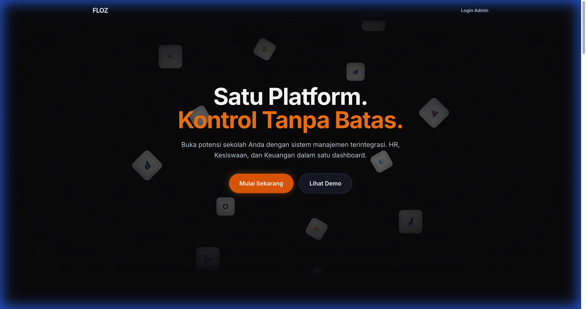
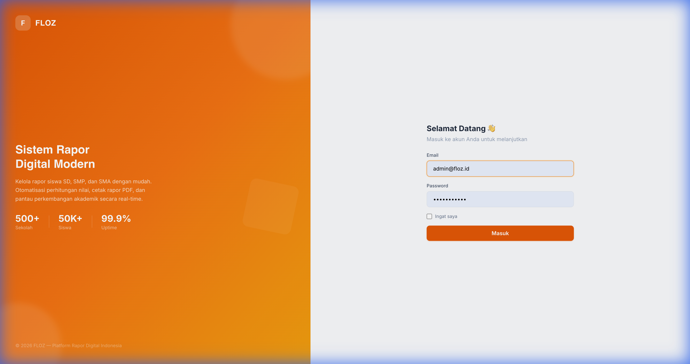

# FLOZ OPENSOURCE LEARNING MANAGEMENT SYSTEM (LMS)


**FLOZ LMS** is a modern, multi-tenant Learning Management System designed for educational institutions to manage academic records, student data, and report cards with ease. Built with Laravel 12 and Vue 3, it offers a robust, scalable, and user-friendly platform for schools.



## 🌟 Key Features

*   **Multi-Tenant Architecture:** Single codebase supporting multiple schools with isolated databases.
*   **Role-Based Access Control (RBAC):** Granular permissions for Super Admins, School Admins, Teachers, Students, and Parents.
*   **Academic Management:** Manage classes, subjects, academic years, and semesters efficiently.
*   **GradeBook System:** Comprehensive grading system supporting K-13 and Merdeka curriculum standards.
*   **Report Card Generation:** Auto-generate PDF report cards with custom templates.
*   **Announcements System:** Rich-text announcements with cover images, pinning, and audience targeting.
*   **Modern UI/UX:** Built with Tailwind CSS and Headless UI for a premium, responsive experience.

## 📸 Screenshots

### Login Portal


## 🛠️ Technology Stack

*   **Backend:** Laravel 12 (PHP 8.2+)
*   **Frontend:** Vue 3, Inertia.js
*   **Styling:** Tailwind CSS
*   **Database:** PostgreSQL 16
*   **Multi-tenancy:** Stancl/Tenancy
*   **Containerization:** Docker & Docker Compose

## 🚀 Getting Started

### Prerequisites
*   Docker & Docker Compose
*   Node.js & NPM
*   Composer

### Installation

1.  **Clone the repository**
    ```bash
    git clone https://github.com/imnatann/floz-lms.git
    cd floz-lms
    ```

2.  **Environment Setup**
    ```bash
    cp .env.example .env
    ```

3.  **Start Services**
    ```bash
    ./vendor/bin/sail up -d
    # Or using custom docker-compose
    docker-compose up -d
    ```

4.  **Install Dependencies**
    ```bash
    composer install
    npm install && npm run build
    ```

5.  **Database Migration**
    ```bash
    php artisan migrate --seed
    ```

6.  **Access the Application**
    *   **Landing Page:** `http://localhost:8000`
    *   **Super Admin:** `admin@floz.id` / `password`

## 🤝 Contributing

Contributions are welcome! Please feel free to submit a Pull Request.

## 📄 License

This project is open-sourced software licensed under the [MIT license](https://opensource.org/licenses/MIT).
